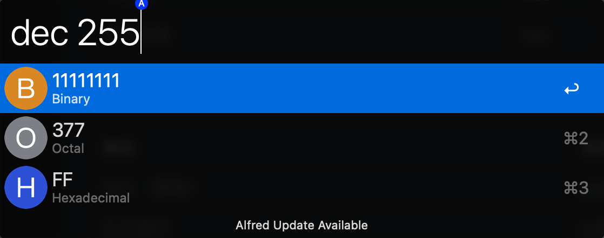

# Gan Alfred Converter

数字转换。

## 功能

### 程序员

| 单位     | 关键字 |
| -------- | ------ |
| 二进制   | bin    |
| 八进制   | oct    |
| 十进制   | dec    |
| 十六进制 | hex    |

### 体积

| 单位         | 关键字 |
| ------------ | ------ |
| 加仑（美制） | gal    |
| 立方英尺     | ccf    |
| 立方米       | m3     |

## 使用

### bin

### oct

### dec

### hex

## License

MIT license. [See LICENSE](https://github.com/Jaesung-Jung/number-system-converter/blob/main/LICENSE) for details.
